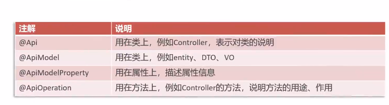

swagger可以帮助我们生成接口文档，以及在线接口调试页面
Knife4j是java mvc框架集成swagger生成api文档的增强解决方案

这里介绍swagger与springboot整合方法

需要引入maven坐标
```
    <dependency>
        <groupId>com.github.xiaoymin</groupId>
        <artifactId>knife4j-spring-boot-starter</artifactId>
        <version>${knife4j}</version>
    </dependency>
```
需要在配置类加入knife4j配置

```java
    @Bean
    public Docket docket() {
        log.info("准备生成接口文档...");
        ApiInfo apiInfo = new ApiInfoBuilder()
                .title("苍穹外卖项目接口文档")
                .version("2.0")
                .description("苍穹外卖项目接口文档")
                .build();
        Docket docket = new Docket(DocumentationType.SWAGGER_2)
                .apiInfo(apiInfo)
                .select()
                // 这里配置的是生成接口文档的目标包
                .apis(RequestHandlerSelectors.basePackage("com.sky.controller"))
                .paths(PathSelectors.any())
                .build();
        return docket;
    }
```

并设置静态资源映射，否则接口文档无法访问
```java
protected void addResourceHandlers(ResourceHandlerRegistry registry) {
        log.info("开始设置静态资源映射...");
        registry.addResourceHandler("/doc.html").addResourceLocations("classpath:/META-INF/resources/");
        registry.addResourceHandler("/webjars/**").addResourceLocations("classpath:/META-INF/resources/webjars/");
    }
```

之和启动后端，访问localhost:8080/doc.html即可访问接口文档界面

可以在代码中添加注解，从而在接口文档中获得更直观的信息

```java
 @PostMapping("/login")
    @ApiOperation("员工登录")
    public Result<EmployeeLoginVO> login(@RequestBody EmployeeLoginDTO employeeLoginDTO) {
         log.info("员工登录：{}", employeeLoginDTO);

        Employee employee = employeeService.login(employeeLoginDTO);

        //登录成功后，生成jwt令牌
        Map<String, Object> claims = new HashMap<>();
        claims.put(JwtClaimsConstant.EMP_ID, employee.getId());
        String token = JwtUtil.createJWT(
                jwtProperties.getAdminSecretKey(),
                jwtProperties.getAdminTtl(),
                claims);

        EmployeeLoginVO employeeLoginVO = EmployeeLoginVO.builder()
                .id(employee.getId())
                .userName(employee.getUsername())
                .name(employee.getName())
                .token(token)
                .build();

        return Result.success(employeeLoginVO);
    }
}
```
